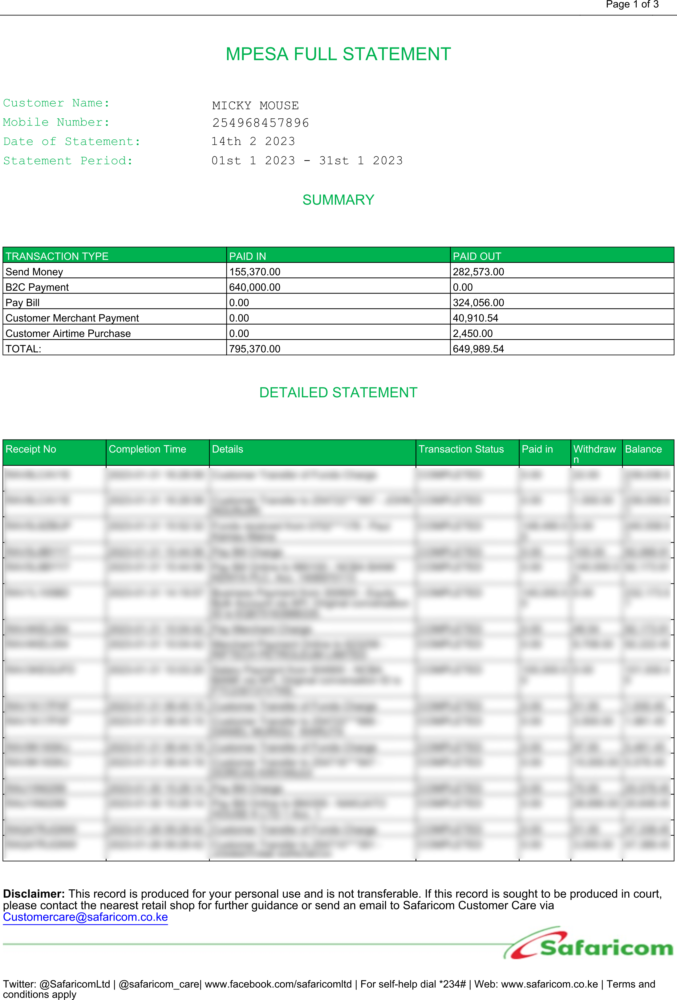

# Convert Your MPesa PDF Account Statement to CSV format

[]

For some unfathomable reason, Safaricom does not seem to provide CSV downloads of transactions on MPesa accounts.  I've looked in the mobile apps.  I've looked at their help pages.  I've looked at their developer documentation. It's nowhere.  Amazing.

This app extracts the data from the PDF account statement using a agglomeration of dirty hacks.  

It does not upload the file to any server.  It can run offline.

It works on statements that look like this:

It won't work if the statement has a different layout.

How it works:
1. The Blazor WASM client collects an MPesa account statement PDF and password from the user using the browser's file upload API.
2. It extracts and parses text using the iText libraries in the browser.  It employs numerous brittle hacks.
3. The user triggers a download.

